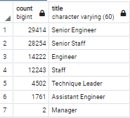
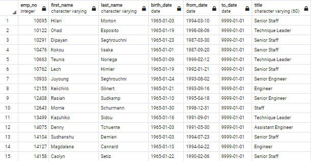
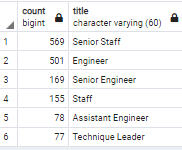
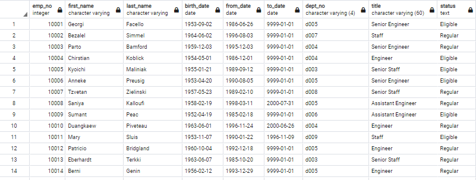
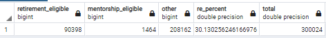

# Employee_Database_Challenge_Analysis
## Overview of the analysis
### Resources
1. Data files
  - employees.csv
  - dept_emp.csv
  - departments.csv
  - dept_manager.csv
  - titles.csv
  - salaries.csv
2. Software: pgAdmin 14, postgreSQL
### Purpose of the project
Pewlett Hackard is being hit with a silver tsunami and the company is upgrading from using excel sheets to manage their employees to a Relational Database.  
The project is to analyse and provide insight to management about the current status of the workforce across the following parameters
- How many employees are close to retirement?
  - Looking at employees who were born between 1952 and 1955
- Which positions will need to be filled in the near future?
  - Split by department
  - Split by job title

## Results
### Deliverable 1: Employees split by title
As part of the initial analysis the key question is **What job titles need to be filled in the near future?**  
To answer this question, we looked at the employees table and the titles table using a join and removed duplicates by using DISTINCT ON.  
From the result we can see that
- Most employees who are due for retirement are Senior Engineers
  - In general senior engineers do majority of the work and are also involved in training and mentoring junior engineers this has major implications for the future of the company  
  - 2 managers are up for retirement, while this is low the company operates a lean system which means there is going to be a shortage of mangerial staff as well  
   


### Deliverable 2: Employees who can be mentored to take on these roles (the filter where to_date is 9999-01-01 is NOT applied, to match results with the challenge)
As part of the second deliverable we looked at employees who were born in 1965 who are currently employed with the company and created a list which the teams can then use for mentorship eligibility.  
- **Key finding: The number of employees who can be mentored are too few compared to the total employees leaving the company**  
- The company must find ways to retain some of the employees and hire enough new workers to ease this transition  

Result below  
  
  

## Summary
### The silver tsunami:
90,398 employees are eligible for retirement in the coming years. While this number shows the scale of replacements which need to be made, I used the below query to show the context of how large the issue is for the company.  
**Key issue 1: Over 30% of employees are retiring**
```sql
--creating a new table called total_employees which has a new column which calculates the status of the employee using a case statement
select distinct on(e.emp_no) e.emp_no,
	e.first_name,
	e.last_name,
	e.birth_date,
	de.from_date,
	de.to_date,
	de.dept_no,
	ti.title, 
	(case when (e.birth_date between '1952-01-01' and '1955-12-31') then 'Eligible'
			  when (e.birth_date BETWEEN '1965-01-01' AND '1965-12-31') and (de.to_date = ('9999-01-01')) then 'Mentorship'
			  else 'Regular'
			  end) as status
into total_employees
from employees as e
left join dept_emp as de
on e.emp_no=de.emp_no
left join titles as ti
on e.emp_no=ti.emp_no
order by e.emp_no;
```
This query gives a new status column which is then used to determine the below results  
  
```sql
--the new table is then used to create another table called employee_by_type
select sum (case when status = 'Eligible' then 1
		   else 0
		   end) as "retirement_eligible",
		   sum (case when status = 'Mentorship' then 1
		   else 0
		   end) as "mentorship_eligible",
		   sum (case when status = 'Regular' then 1
		   else 0
		   end) as "other"
		   --title
into employee_by_type		   
from total_employees
--group by title
order by count(emp_no) DESC;

--update and alter table statements used to create calculated fields in the table
alter table employee_by_type
Add column total float
update employee_by_type set total = employee_by_type.retirement_eligible + employee_by_type.mentorship_eligible + employee_by_type.other;
update employee_by_type set re_percent = (employee_by_type.retirement_eligible/employee_by_type.total)*100;
```
  

### Does the company have enough qualified employees to mentor?
**YES** Only 1,464 employees are eligible for mentorship. There is infact an abundance of employees who can mentor this small group.
- The company needs to identify more employees and put them into the mentorship program
